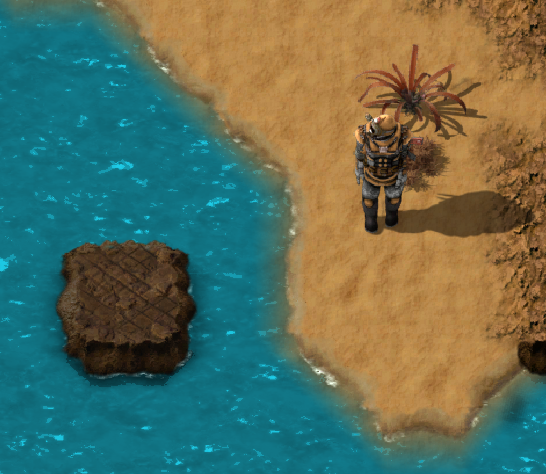
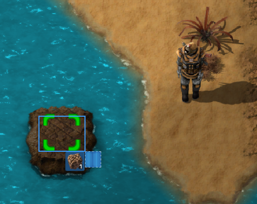
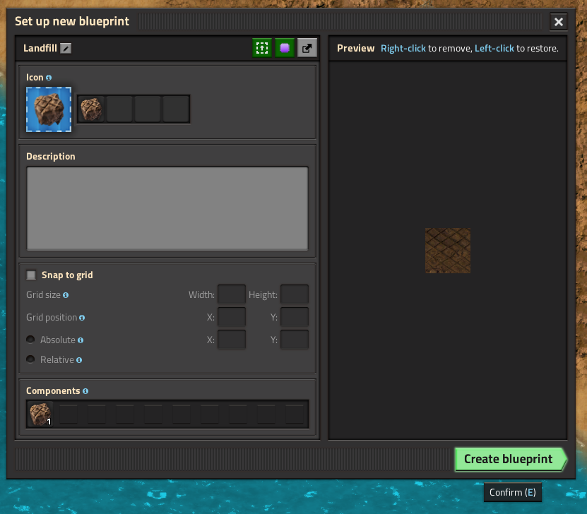
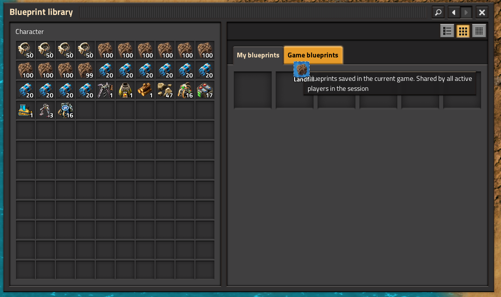
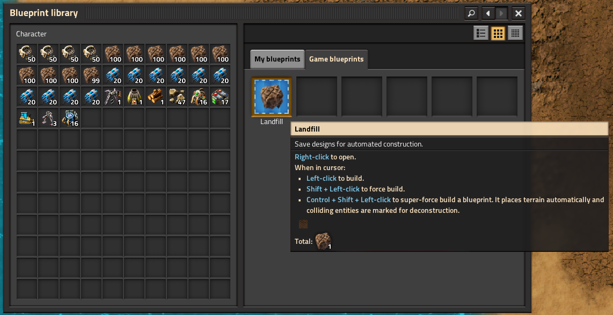

Introduction
============

BulldozerEquipment is a mod for [Factorio](https://wiki.factorio.com/).
It adds an equipment component that automatically orders the
deconstruction of all nearby trees, rocks, and cliffs, and orders nearby
water to be filled with landfill.

The primary intended use case is to equip the lead tanks of a
[RoboTank](https://mods.factorio.com/mod/RoboTank) formation with the
equipment so that they will order a path to be cleared.  The robots that
do the actual clearing can be carried by the player, the RoboTanks, or
both.  It allows the formation to roll though virtually any obstacle,
provided it has enough resources (cliff explosives and landfill), free
space to store the trash, and armor and armament to deal with hostiles.

It is also useful out of combat, conveniently clearing obstacles and
providing buildable space otherwise blocked by water.

Usage
=====

First, research Bulldozer Equipment.  Its prerequisites are
Utility (yellow) Science and Belt Immunity Equipment.

Create the Bulldozer Equipment item and put it into the equipment grid
of a player character or a vehicle.  Ensure the grid can supply the
required 150 kW of power.  This equipment also provides the function of
the Belt Immunity equipment, so you can remove that if you have it.

Approach some trees or rocks.  They will be automatically marked for
destruction.

Landfilling water
-----------------

The landfill function requires that you first create a blueprint
containing exactly one landfill tile and put it into the *game*
blueprint library:

1. Place a tile of landfill.

2. Press Alt-B, then select just that *one* tile to create a blueprint
   of it.  The blueprint must have exactly one tile and no entities for
   the mod to recognize it.

3. Press "Create blueprint" to finish creating it.  You can give the
   blueprint a name if you want, but the mod does not care about its
   name.

4. With the new blueprint still on your mouse cursor, press B to open
   the blueprint library, then click on the "Game blueprints" tab.

5. Click in any open square to place the blueprint into that tab.

6. Press E to close the blueprint library.

Now, approach some water, and it will be automatically marked for
landfilling using the created blueprint.

Landfilling cliffs
------------------

Cliffs will be automatically marked for destruction once Cliff
Explosives have been researched.  In the Space Age expansion, that
requires visiting another planet.  Until then, the Bulldozer Equipment
will ignore cliffs.

Performance considerations
==========================

For both player characters and vehicles, the mod only activates when the
actor moves, so the cost is generally small.

The process of designating tiles for landfilling is somewhat slow, so if
the mod is configured to use a large tile search radius and short period
between checks, there could be a UPS hit when approaching a shoreline.

Related mods
============

The "latest version" age in the list below is relative to 2024-12-21.

Available for Factorio 2.x
--------------------------

* [Tree Cleaner](https://mods.factorio.com/mod/TreeCleaner) by
  GPS: Marks dead trees for deconstruction.

  * Latest version: 0.2.1 (26 days ago)

* [King Jo's Bulldozer](https://mods.factorio.com/mod/kj_bulldozer) by
  TheKingJo: A vehicle intended, I think, to simply ram into the trees
  and rocks.

  * Latest version: 2.0.0 (30 days ago)

Only for Factorio 1.x
---------------------

* [Bulldozer](https://mods.factorio.com/mod/bulldozer) by ckhawks

  * Latest version: 1.3.4 (7 years ago).

* [Bulldozer-Fixed](https://mods.factorio.com/mod/bulldozer-fixed) by
  amwdrizz: Obsolete fork of ckhawks Bulldozer.

  * Latest version: 1.3.3 (8 years ago)

* [Bulldozer](https://mods.factorio.com/mod/Bulldozzer) by InsanePyro

  * Latest version: 1.0.0 (3 years ago).

* [Dozer](https://mods.factorio.com/mod/dozer) by shanemadden: Provides
  a tank-like vehicle that destroys cliffs and mines mineable
  non-resource entities (trees, rocks, buildings) that are near the
  vehicle.

  * Latest version: 1.5.0 (4 years ago).

  * It does not do anything about water.

  * Destruction and mining are instantaneous rather than being done by
    robots.

Acknowledgements
================

The bulldozer icon  comes from
<a href="https://www.freepik.com/icon/bulldozer_10984315#fromView=keyword&page=2&position=94&uuid=7c749113-0d7b-4d98-8946-5d19b072c52d">Freepik</a>.
