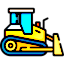

Introduction
============

BulldozerEquipment is a mod for [Factorio](https://wiki.factorio.com/).
It adds an equipment component that automatically orders the
deconstruction of all nearby trees, rocks, and cliffs, and orders nearby
water to be filled with landfill.

The primary intended use case is to equip the lead tanks of a
[RoboTank](https://mods.factorio.com/mod/RoboTank) formation with the
equipment so that they will order a path to be cleared.  The robots that
do the actual clearing can be carried by the player, the RoboTanks, or
both.  It allows the formation to roll though virtually any obstacle,
provided it has enough resources (cliff explosives and landfill), free
space to store the trash, and armor and armament to deal with hostiles.

Among other things, this equipment allows attacking while moving south
with a RoboTank squad, which is otherwise nearly impossible to due the
compressed screen size in that direction and the toolbars blocking
access to the world in that direction.

As a secondary function, the bulldozer equipment automatically converts
all wood, coal, and stone in the main or trash inventories into landfill
at a cost of one stack per landfill.

Usage
=====

First, research Bulldozer Equipment.  Its main prerequisite is
Utility (yellow) Science.

Create the Bulldozer Equipment item and put it into the equipment grid
of a player character or a vehicle (a car or tank).  Ensure the grid can
supply the required 50 kW of power, although this only drains while
moving.

Clearing obstacles
------------------

If you now approach some trees or rocks, they will be automatically
marked for destruction, and if you approach water, it will be marked for
landfilling.  Cliffs will also be automatically marked for destruction
once Cliff Explosives have been researched.

Landfill creation
-----------------

When the bulldozer is in a player character's equipment grid,
periodically (by default, once per second), one stack of wood, coal, or
stone will be turned into landfill.  When it is in a vehicle equipment
grid, the same thing happens, but *only while the vehicle is moving*
(this is primarily meant as a performance optimization).

This feature means you don't have to stop to tediously empty all of the
vehicles' inventories of the trash they have collected.  It also
provides the minor benefit of supplying a little extra landfill,
although typically far below the replacement level when doing
significant filling of water.

Balance considerations
======================

The basic function of ordering obstacle destruction is purely a user
interface enhancement, so does not raise significant balance issues.

Creating landfill from wood and coal is something a few other mods also
provide.  In my games, by the time I'm dealing with behemoth biters,
wood and coal are so worthless that I just put them into wooden boxes
and then shoot the boxes to destroy the items (whereas I can right-click
spam the landfill button to eliminate stone).  Having *some* use for
wood and coal is a very minor player buff.

Performance considerations
==========================

For both player characters and vehicles, the obstacle clearing function
only activates when the actor moves, so the cost is generally small.

The process of designating tiles for landfilling is somewhat slow, so if
the mod is configured to use a large tile search radius and short period
between checks, there could be a UPS hit when approaching a shoreline.

Related mods
============

Available for Factorio 2.x
--------------------------

* [Tree Cleaner](https://mods.factorio.com/mod/TreeCleaner) by
  GPS: Marks dead trees for deconstruction.

* [King Jo's Bulldozer](https://mods.factorio.com/mod/kj_bulldozer) by
  TheKingJo: A vehicle intended, I think, to simply ram into the trees
  and rocks.

Only for Factorio 1.x
---------------------

* [Bulldozer](https://mods.factorio.com/mod/bulldozer) by ckhawks

* [Bulldozer-Fixed](https://mods.factorio.com/mod/bulldozer-fixed) by
  amwdrizz: Obsolete fork of ckhawks Bulldozer.

* [Bulldozer](https://mods.factorio.com/mod/Bulldozzer) by InsanePyro

* [Dozer](https://mods.factorio.com/mod/dozer) by shanemadden: Provides
  a tank-like vehicle that destroys cliffs and mines mineable
  non-resource entities (trees, rocks, buildings) that are near the
  vehicle.  Destruction and mining are instantaneous rather than being
  done by robots.

Acknowledgements
================

The bulldozer icon  comes from
<a href="https://www.freepik.com/icon/bulldozer_10984315#fromView=keyword&page=2&position=94&uuid=7c749113-0d7b-4d98-8946-5d19b072c52d">Freepik</a>.
